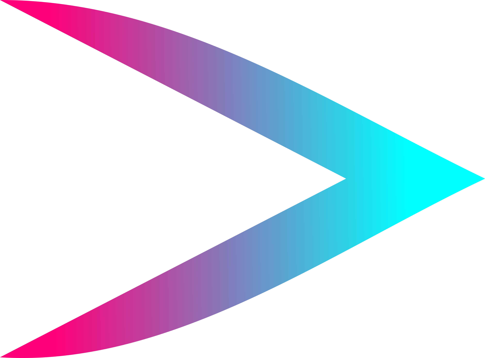

<!-- PROJECT SHIELDS -->
<!--
*** I'm using markdown "reference style" links for readability.
*** Reference links are enclosed in brackets [ ] instead of parentheses ( ).
*** See the bottom of this document for the declaration of the reference variables
*** for contributors-url, forks-url, etc. This is an optional, concise syntax you may use.
*** https://www.markdownguide.org/basic-syntax/#reference-style-links
-->
[![Contributors][contributors-shield]][contributors-url]
[![Forks][forks-shield]][forks-url]
[![Stargazers][stars-shield]][stars-url]
[![Issues][issues-shield]][issues-url]
[![MIT License][license-shield]][license-url]
[![LinkedIn][linkedin-shield]][linkedin-url]

<!-- PROJECT LOGO -->
<br />
<p align="center">
  <a href="https://github.com/cosmin-bianu/sldr-android">
    
  </a>

  <h3 align="center">Slider Desktop</h3>

  <p align="center">
   Application used to turn Android phones into presentation remote controls when paired with <a href="https://github.com/cosmin-bianu/sldr-desktop">Slider Desktop</a>. The desktop application supports multiple presenters and is able to lock individual presenter's devices. It's also capable of running single presenter mode with the ability to switch the currently presenting device. This project earned my computer science certificate in my final year of high school (2019).
    <br />
    <br />
    <a href="https://github.com/cosmin-bianu/sldr-android/issues">Report Bug</a>
    ·
    <a href="https://github.com/cosmin-bianu/sldr-android/issues">Request Feature</a>
  </p>
</p>


<!-- TABLE OF CONTENTS -->
<details open="open">
  <summary><h2 style="display: inline-block">Table of Contents</h2></summary>
  <ol>
    <li>
      <a href="#about-the-project">About The Project</a>
      <ul>
        <li><a href="#built-with">Built With</a></li>
      </ul>
    </li>
    <li>
      <a href="#getting-started">Getting Started</a>
      <ul>
        <li><a href="#prerequisites">Prerequisites</a></li>
        <li><a href="#installation">Installation</a></li>
      </ul>
    </li>
    <li><a href="#usage">Usage</a></li>
    <li><a href="#roadmap">Roadmap</a></li>
    <li><a href="#contributing">Contributing</a></li>
    <li><a href="#license">License</a></li>
    <li><a href="#contact">Contact</a></li>
  </ol>
</details>


<!-- ABOUT THE PROJECT -->
## About The Project

Android application for Slider. This acts as a remote control giving next/previous slide controls and lock mechanism so that the user doesn't accidentally change slides. The user is also able to control the slides with the screen off using the volume buttons.

<!-- GETTING STARTED -->
## Getting Started

To connect the Android Device to the desktop application, the Android and Windows devices **must** be on the same network.

### Prerequisites

* An Android Device with [USB Debugging](https://developer.android.com/studio/debug/dev-options) enabled
* Android Studio

### Installation

* Dowload the application from the [releases page](https://github.com/cosmin-bianu/sldr-android/releases) or from Google Play (soon to be published)

* Alternatively, build the application on your machine

1. Clone the repo
   ```sh
   git clone https://github.com/cosmin-bianu/sldr-android.git sldr-android
   ```
2. Open the project in Android Studio
3. Connect your Android device to your desktop
4. Run as debug mode (or you can compile an apk)
5. Wait for the application to be installed

<!-- USAGE EXAMPLES -->
## Usage

1. Make sure the Android and Windows devices are on the same network, otherwise it will not work
2. Open the [Slider Desktop](https://github.com/cosmin-bianu/sldr-desktop) application and grant it access through the firewall if prompted
3. Open the Android Application and scan the QR code displayed on the screen
4. Open the slides and go into presentation mode. The Slider Desktop app emulates Left Arrow and Right Arrow keypresses, so make sure to have the presentation window selected at all times.

### Multi-presenter

<p align="center">
    
</p>

If you need multiple Android devices connected at the same time, repeat step 3 for all mobile devices.

The application allows you to lock the controls for devices so that only a select number of Android devices will have slides control
The devices can be locked from the Android Application too, but only for that particular device

If you need to have devices connected in advance, but want to lock the controls for all except one during the whole presentation, you can use single presenter mode where the user can select and change which device will have controls enabled while the rest will have them disabled. 

<!-- ROADMAP -->
## Roadmap

See the [open issues](https://github.com/cosmin-bianu/sldr-android/issues) for a list of proposed features (and known issues).

<!-- CONTRIBUTING -->
## Contributing

Contributions are what make the open source community such an amazing place to be learn, inspire, and create. Any contributions you make are **greatly appreciated**.

1. Fork the Project
2. Create your Feature Branch (`git checkout -b feature/AmazingFeature`)
3. Commit your Changes (`git commit -m 'Add some AmazingFeature'`)
4. Push to the Branch (`git push origin feature/AmazingFeature`)
5. Open a Pull Request


<!-- LICENSE -->
## License

Distributed under the Apache 2.0 License. See `LICENSE` for more information.


<!-- CONTACT -->
## Contact

Cosmin Bianu - kitsune.cosmin@gmail.com

Project Link: [https://github.com/cosmin-bianu/sldr-android](https://github.com/cosmin-bianu/sldr-android)

<!-- MARKDOWN LINKS & IMAGES -->
<!-- https://www.markdownguide.org/basic-syntax/#reference-style-links -->
[contributors-shield]: https://img.shields.io/github/contributors/cosmin-bianu/sldr-android.svg?style=for-the-badge
[contributors-url]: https://github.com/cosmin-bianu/sldr-android/graphs/contributors
[forks-shield]: https://img.shields.io/github/forks/cosmin-bianu/sldr-android.svg?style=for-the-badge
[forks-url]: https://github.com/cosmin-bianu/sldr-android/network/members
[stars-shield]: https://img.shields.io/github/stars/cosmin-bianu/sldr-android.svg?style=for-the-badge
[stars-url]: https://github.com/cosmin-bianu/sldr-android/stargazers
[issues-shield]: https://img.shields.io/github/issues/cosmin-bianu/sldr-android.svg?style=for-the-badge
[issues-url]: https://github.com/cosmin-bianu/sldr-android/issues
[license-shield]: https://img.shields.io/github/license/cosmin-bianu/sldr-android.svg?style=for-the-badge
[license-url]: https://github.com/cosmin-bianu/sldr-android/blob/master/LICENSE.txt
[linkedin-shield]: https://img.shields.io/badge/-LinkedIn-black.svg?style=for-the-badge&logo=linkedin&colorB=555
[linkedin-url]: https://linkedin.com/in/cosmin-bianu
